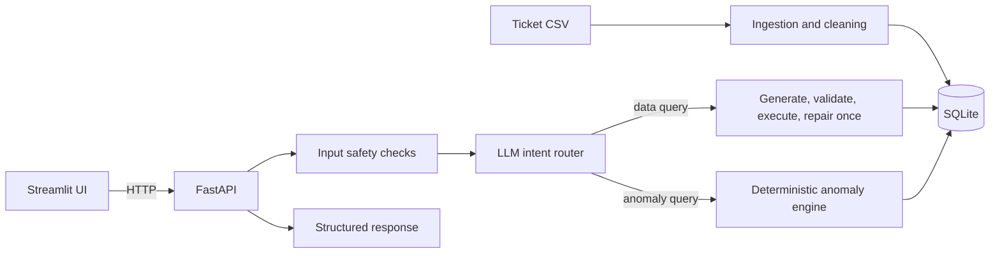

# Support Ticket AI

An AI-assisted customer support analytics prototype for querying ticket data in natural language and detecting operational anomalies. The application provides a FastAPI service and a Streamlit interface backed by a cleaned SQLite database.

## Features

- Ingests and validates `data/support_tickets.csv`, normalizes supported column aliases, and preserves empty values as SQL `NULL`.
- Answers natural-language questions using LLM-generated SQLite SQL. Responses include the SQL used to produce the result.
- Detects ticket, agent, and data-quality anomalies using deterministic rules and robust statistics.
- Provides REST endpoints for questions, anomalies, health, and ticket statistics.
- Supports Groq and local Ollama through a shared client interface, with provider fallback enabled by default.
- Includes a 500-row demonstration dataset with deliberately injected anomalies.

## Requirements

- Python 3.11 or later, or Docker Compose.
- A Groq API key for hosted inference, or Ollama with a model downloaded locally. Groq free-tier limits may apply.

The bundled dataset is `data/support_tickets.csv`. To regenerate it, run `python -m scripts.generate_sample_data --force`. This overwrites the existing CSV.

## Quick Start

### Docker Compose

Copy the example configuration and add a Groq key to `.env`:

```powershell
Copy-Item .env.example .env
```

Edit `.env` locally and set `GROQ_API_KEY`. Keep the key private and do not commit `.env`. From the repository root, start the API and UI:

```sh
docker-compose up
```

- Streamlit UI: <http://localhost:8501>
- API documentation: <http://localhost:8000/docs>

Compose builds the image on first start. Stop the services with `Ctrl+C`.

### Local Python

Create and activate a virtual environment, install dependencies, and copy the example configuration:

```powershell
py -m venv .venv
.venv\Scripts\Activate.ps1
python -m pip install -r requirements.txt
Copy-Item .env.example .env
```

Set `GROQ_API_KEY` in `.env`. Run the API and UI from separate terminals:

```sh
uvicorn app.main:app --reload --port 8000
```

```sh
streamlit run ui/streamlit_app.py
```

For macOS or Linux, activate the environment with `source .venv/bin/activate` and copy the example file with `cp .env.example .env`.

### Ollama

Install Ollama, download the configured model, and set `LLM_PROVIDER=ollama` in `.env`:

```sh
ollama pull llama3.1:8b
```

For a host-installed Ollama used by the local Python app, the example `OLLAMA_HOST=http://localhost:11434` is appropriate. To run Ollama as a Docker Compose service, set `OLLAMA_HOST=http://ollama:11434` and start the profile:

```sh
docker-compose --profile ollama up
docker-compose exec ollama ollama pull llama3.1:8b
```

## Configuration

Settings are loaded from environment variables or `.env` by `app/config.py`.

| Variable | Default | Purpose |
|---|---|---|
| `LLM_PROVIDER` | `groq` | Primary provider: `groq` or `ollama`. |
| `LLM_FALLBACK` | `true` | Try the other provider if the primary fails. |
| `GROQ_API_KEY` | empty | Groq API key. Keep it private. |
| `GROQ_MODEL` | `openai/gpt-oss-120b` | Groq model identifier. Override if it is unavailable to your account. |
| `OLLAMA_HOST` | `http://localhost:11434` | Ollama API URL. |
| `OLLAMA_MODEL` | `llama3.1:8b` | Local Ollama model. |
| `REFERENCE_TIME` | dataset maximum | Timestamp used for relative-date and ticket-age calculations. |
| `AGING_HOURS` | `24` | Age threshold for unresolved High/Critical tickets. |
| `LLM_SUMMARY` | `false` | Enable an optional LLM-written result summary. |
| `API_URL` | `http://localhost:8000` | API base URL used by the UI. |

Relative dates default to `MAX(created_at)` in the dataset instead of the machine clock because the data is historical. Set `REFERENCE_TIME` to override it.

## Architecture



### Design Decisions

- **Text-to-SQL:** the model generates a query, while SQLite computes filters and aggregates. Each response exposes its SQL for review.
- **SQLite:** a single local database keeps setup simple for the demonstration dataset.
- **SQL safety:** `sqlglot` parses generated SQL. Only one `SELECT` or `WITH` query against allow-listed tables and columns is accepted. Queries are capped with `LIMIT` and run on a read-only connection with a timeout.
- **Deterministic anomaly detection:** rules and robust statistics make findings reproducible and explainable without asking the LLM to judge data quality.
- **FastAPI and Streamlit:** the API is independently usable; the UI communicates with it over HTTP.

The router classifies a question as a data query, anomaly request, or out-of-scope request. Data questions use an LLM-generated SQL query, validation, read-only execution, and at most one repair attempt after a query error. Anomaly questions use the deterministic engine. Empty results are returned as empty rather than inferred.

Destructive and prompt-injection requests are blocked before SQL execution. If both providers fail, the API returns a structured `503` response. Questions must contain 1 to 500 characters and pass basic text validation.

## Anomaly Rules

`GET /anomalies` returns findings with type, severity, reason, observed value, threshold, and ticket or agent identifiers when applicable.

| Type | Rule |
|---|---|
| `unresolved_high_priority_aging` | High or Critical ticket not Resolved and older than `AGING_HOURS` (default 24) at the reference time. Critical tickets and tickets older than 72 hours are high severity; other matches are medium severity. |
| `abnormal_resolution_time` | Robust z-score above 3.5 on `log1p(resolution_time_hrs)`, using category/priority, then priority, then global baselines. A group needs at least 8 observations for its own baseline. |
| `abnormal_response_time` | The same robust method applied to response time. |
| `agent_outlier` | Agent average rating far below, or average resolution time far above, the team baseline (robust z-score above 2.5). At least 5 observations per agent and 4 agents are required. |
| `data_inconsistency` | Resolution time is shorter than response time; an Open ticket has a rating; or a Resolved ticket has no resolution time. |

Time-based ticket outliers use the median and median absolute deviation of log-transformed hours. With `days=N`, ticket anomalies are filtered by `created_at` relative to the reference time; agent aggregates are calculated over the same window.

## API

Interactive API documentation is available at `/docs` while the service is running.

| Method and path | Description |
|---|---|
| `GET /health` | Database row count, provider configuration and reachability, and reference time. |
| `POST /query` | Answer a natural-language question. Body: `{"question":"How many tickets are open?"}`. |
| `GET /anomalies` | Return anomaly findings; supports `days`, `type`, `severity`, and `limit` filters. |
| `GET /stats` | Ticket totals grouped by status, priority, and category. |

Example requests:

```sh
curl http://localhost:8000/health

curl -X POST http://localhost:8000/query \
  -H "Content-Type: application/json" \
  -d '{"question":"How many Critical tickets are unresolved?"}'

curl "http://localhost:8000/anomalies?type=unresolved_high_priority_aging&severity=high&limit=20"
```

Errors use the shape `{"error":{"code":"...","message":"..."}}`. Invalid questions return `422`; an unavailable LLM returns `503`.

## Example Results

The examples below were executed through the API and SQLite against the bundled dataset (500 rows; reference time `2024-03-31 06:06`). A scripted test LLM supplied deterministic routing and SQL, so the examples are reproducible without a provider call. SQL execution and response formatting use the real application; a live model may generate equivalent SQL with different formatting. Anomaly questions do not produce SQL because their rules run in code.

### Open ticket count

Answer: `Open tickets: 98`

```sql
SELECT COUNT(*) AS open_tickets
FROM tickets
WHERE status = 'Open'
LIMIT 100
```

### Unresolved Critical tickets

Answer: `Unresolved critical tickets: 22`. Unresolved means Open or Escalated.

```sql
SELECT COUNT(*) AS unresolved_critical_tickets
FROM tickets
WHERE priority = 'Critical'
  AND status IN ('Open', 'Escalated')
LIMIT 100
```

### Agent with the lowest average rating

Answer: `AGT-07`, average rating `2.76` across `17` rated tickets.

```sql
SELECT agent_id,
       ROUND(AVG(customer_rating), 2) AS avg_rating,
       COUNT(customer_rating) AS rated_tickets
FROM tickets
WHERE customer_rating IS NOT NULL
GROUP BY agent_id
ORDER BY avg_rating ASC, agent_id
LIMIT 1
```

### Agent with the most resolutions this month

Answer: `AGT-04` with `19` resolved tickets. There is no resolution timestamp, so the month is based on `created_at`.

```sql
SELECT agent_id, COUNT(*) AS resolved_tickets
FROM tickets
WHERE status = 'Resolved'
  AND strftime('%Y-%m', created_at) = strftime('%Y-%m', '2024-03-31 06:06:00')
GROUP BY agent_id
ORDER BY resolved_tickets DESC, agent_id
LIMIT 1
```

### Critical tickets not resolved within 12 hours

Answer: `Found 22 rows`; the first result is `TKT-006` (Open, resolution time `NULL`). Tickets without a resolution time are treated as not resolved within the threshold.

```sql
SELECT ticket_id, created_at, status, resolution_time_hrs, agent_id, issue_summary
FROM tickets
WHERE priority = 'Critical'
  AND (resolution_time_hrs IS NULL OR resolution_time_hrs > 12)
ORDER BY created_at
LIMIT 100
```

### Average Technical ticket rating

Answer: `Avg rating: 3.67`

```sql
SELECT ROUND(AVG(customer_rating), 2) AS avg_rating
FROM tickets
WHERE category = 'Technical'
LIMIT 100
```

### Resolution anomalies this week

Answer: `No anomalies found for the last 7 days up to 2024-03-31 06:06.` The full dataset contains 4 `abnormal_resolution_time` findings. Query the endpoint with `GET /anomalies?type=abnormal_resolution_time`.

To capture live responses from a running API, run `python -m scripts.capture_examples`. The script writes results to `docs/example_outputs.md`.

## Development and Tests

Tests use a mocked LLM and do not require provider credentials or network access:

```sh
pytest
```

The suite covers ingestion and cleaning, SQL safety, anomaly rules, NL-to-SQL parsing and repair, API behavior, and SQL results compared with independent pandas calculations.

## Limitations

- Relative dates use the dataset maximum unless `REFERENCE_TIME` is set. The schema has no resolution timestamp, so monthly resolution questions use ticket creation time.
- Ambiguous questions may be interpreted differently by different models. Responses include assumptions and generated SQL to support review.
- Queries are scoped to one table; the prototype does not provide conversation memory, authentication, or role-based access.
- Groq free-tier limits can affect availability. Fallback requires the second provider to be configured and reachable.
- Anomaly thresholds are documented defaults, not thresholds trained on labelled incidents.

## Project Structure

```text
app/
  main.py, config.py, schemas.py, db.py, ingestion.py, errors.py, constants.py
  llm/       provider clients, prompts, and response parsing
  services/  routing, NL-to-SQL, SQL guard, anomaly engine, and formatting
ui/          Streamlit application
scripts/     demo data generation and example capture
tests/       API, ingestion, anomaly, SQL guard, NL-to-SQL, and ground-truth tests
data/        support_tickets.csv and runtime SQLite database
```

## Future Work

Potential extensions include semantic search over `issue_summary`, caching, authentication and rate limiting, a text-to-SQL evaluation harness, Postgres support, asynchronous processing, and monitoring.
